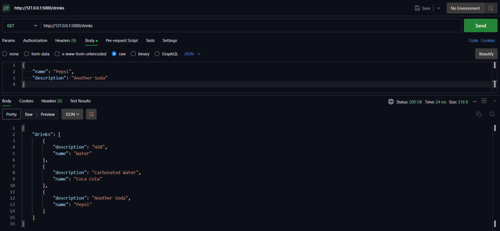
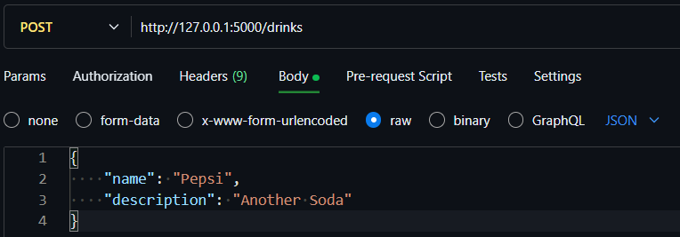
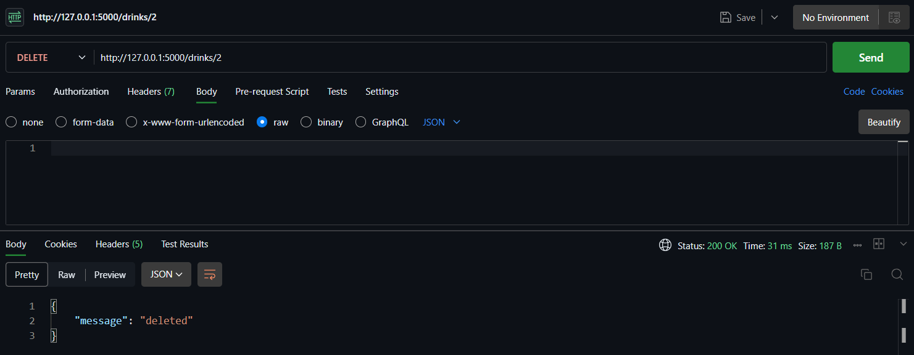

# Rest Flask API

## Setup

1. Create a python virtual environment with `python3 -m venv venv`
2. Activate the virtual environment with `venv\Scripts\activate`
3. Install the required packages with `pip install -r requirements.txt`
4. Setup the environment variables with `$env:FLASK_APP='application.py'` and `$env:FLASK_ENV='development'` (You have to do this every time you open a new terminal)
5. Run the application with `flask run` (Make sure to re-run the application every time you make changes to application.py)

## Setup database

1. Stop your flask run with `Ctrl + C`
2. Go inside interactive python shell with `python`
3. Import db, app and Drink with `from application import *`
4. Create the database, make a new drink, add that drink to database, and commit to database with

```python
with app.app_context():
    db.create_all()
    drink = Drink(name='Water', description='H20')
    db.session.add(drink)
    db.session.commit()
```

5. If you want to add new entery to database maunally like

```python
with app.app_context():
    db.session.add(Drink(name='Coca Cola', description='Carbonated Water'))
    db.session.commit()
```

## Postman

You can also get, add, and delete a new entry using Postman
URL will be the link your flask server is running (in my case its localhost:5000/drink)

To get list of drinks, you can use set method to GET and hit Send


To add a drink, change method to POST, and body should be raw in JSON format and hit Send


To delete a drink, tweak the URL to <your_url>/<id_of_valid_item> change method to DELETE, and hit Send

